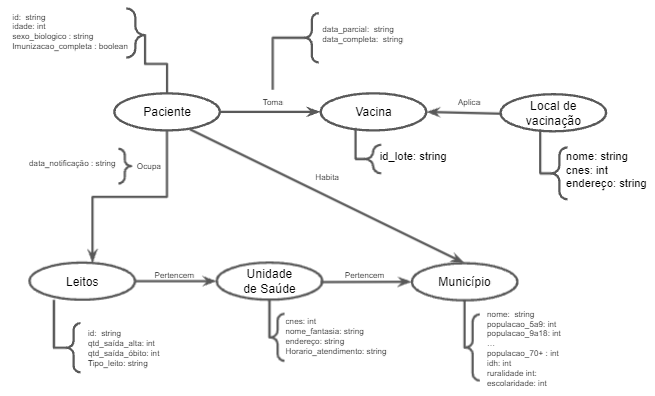

# Lab08 - Modelo Lógico e Análise de Dados em Grafos

# Equipe CSVac - JHGMA
* Maria Angélica Lobo Alves Paulino - 183465
* Gabriella Serrano Santana - 216698
* José Henrique Dioz Récio - 176622

## Modelo Lógico Combinado do Banco de Dados de Grafos

## Perguntas de Pesquisa/Análise Combinadas e Respectivas Análises

### Pergunta/Análise 1
* Municípios com boa escolaridade possuem maiores índices de vacinação? Tendo isso em vista, pode-se afirmar que uma boa educação ajuda na conscientização da necessidade de tomar vacinas? 
  * Será indentificado quais municípios possuem escolaridade acima da média e se eles também possuem porcentagem de vacinados acima da média. Modalidade de análise: centralidade; vulnerabilidade; comunidade/modularidade; motifs; predição de links. 

### Pergunta/Análise 2
 * O índice de ruralidade do município influencia nos óbitos e na velocidade/aderência da vacinação?

### Pergunta/Análise 3
 * O IDHM (IDH do municipio) tem alguma relação com o índice de pessoas vacinadas? E de mortalidade?
   * Será indentificado quais municípios possuem IDHM acima da média e se eles também possuem porcentagem de vacinados acima da média. Modalidade de análise: centralidade; vulnerabilidade; comunidade/modularidade; motifs; predição de links. 

### Pergunta/Análise 4
* Qual é a média de pessoas que são internadas na UTI por COVID-19 e saem vivas? Qual é a chance de uma pessoa internada na UTI por consequência da COVID-19 sair com vida? 
  * Será calculadoo número de pessoas internado na UTI em um 
 
### Pergunta/Análise 5
 * Qual é a diferença entre a porcentagem de mulheres que tomaram a vacina e homens que tomaram a vacina? Sabendo isso, essa diferença é relevante? Existe a necessidade de uma campanha de conscientização de vacinação mais direcionada por gênero?

### Pergunta/Análise 6
 * Qual o percentual por faixa etária de pessoas que foram vacinadas em um determinado período de tempo em determinada cidade? Com base nisso, qual deve ser o maior público alvo da campanha de vacinação durante esse período?
