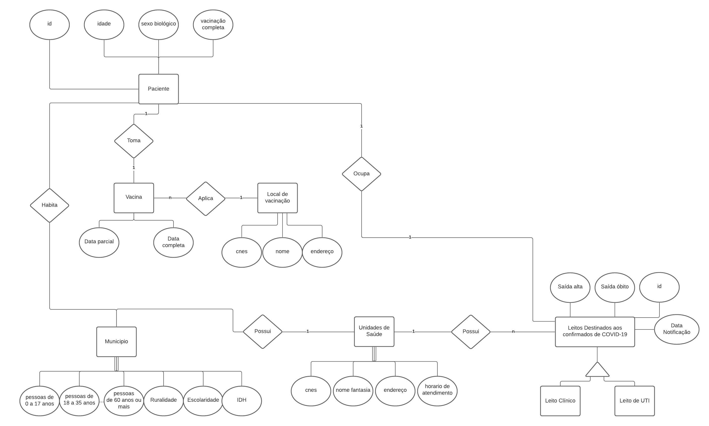
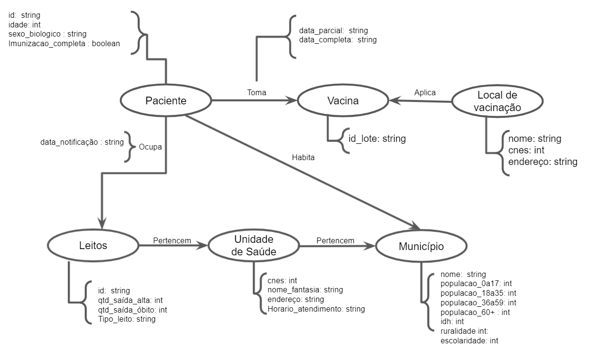

# Projeto CSVac

# Equipe CSVac - JHGMA
* José Henrique Dioz Récio - RA: 176622
* Maria Angélica Lobo Alves Paulino - RA: 183465
* Gabriella Serrano Santana - RA: 216698

## Resumo do Projeto
Diante a pandemia de COVID-19 declarada em março de 2020 e que se estende até os dias atuais, surgiu a necessidade do gerenciamento dos dados de ocupação de leitos, crescimento da doença e vacinação pelo Ministério da Saúde e disponibilizados no DATASUS com a finalidade de compreender melhor a situação do país e otimizar a gestão de recursos.

Nosso projeto consiste em analisar majoritariamente os seguintes bancos de dados:

* Campanha Nacional de Vacinação contra Covid-19
* Registro de Ocupação Hospitalar COVID-19
* Base de dados do CNES
* Sinopse do Censo Demográfico 2010 Sergipe

Nossa proposta é relacionar a vacinação contra a COVID-19, a ocupação de leitos, escolaridade, ruralidade, entre outros aspectos que consideramos relevantes e serão detalhados ao longo do projeto. Consideramos essa análise muito importante para combater a desinformação e promover a ciência e seus impactos no bem estar da população. Ademais, fizemos um recorte dessa análise para o estado de Sergipe.

## Slides da Apresentação
> Coloque aqui o link para o PDF da apresentação prévia

## Modelo Conceitual Preliminar

## Modelos Lógicos Preliminares
Relacional
~~~
Vacinação(_cidade_, data, qtd_0a17anos,  qtd_18a35anos,  qtd_36a59anos, qtd_60+, qtd_mulheres, qtd_homens)

Local_de_Vacinação(_nome_, cnes, endereço, cidade, qtd_vacina)

Leitos(_cidade_, data, ocupação_leitos_clinico, ocupação_leitos_uti, saida_obitos, saida_altas)

Unidade_de_saúde(_cnes_, nome_fantasia, endereço, cidade, qtd_leito)

Município(_nome_, idh, escolaridade, ruralidade, pop_0a17anos,  pop_18a35anos,  pop_36a59anos, pop_60+)
~~~
> Falta crescentar as infos de chave estrangeira

Grafos de propriedades

## Dataset Preliminar a ser Publicado
> Elencar os arquivos/bases preliminares dos datasets serão publicados publicados.

título do arquivo/base | link | breve descrição
----- | ----- | -----
`<título da base>` | `<link para a página da base>` | `<breve descrição da base>`

## Bases de Dados

Título da base | Link | Descrição
----- | ----- | -----
Campanha Nacional de Vacinação contra Covid-19 | `<link para arquivo/base>` | `<breve descrição do arquivo/base>`
Registro de Ocupação Hospitalar COVID-19 | `<link para arquivo/base>` | `<breve descrição do arquivo/base>`
Base de dados do CNES | `<link para arquivo/base>` | `<breve descrição do arquivo/base>`
Sinopse do Censo Demográfico 2010 Sergipe | `<link para arquivo/base>` | `<breve descrição do arquivo/base>`

## Operações realizadas para a construção do dataset

> Coloque um link para o arquivo do notebook, programas ou workflows que executam as operações de construção do dataset:
* extração de dados de fontes não estruturadas como, por exemplo, páginas Web
* agregação de dados fragmentados obtidos a partir de API
* integração de dados de múltiplas fontes
* tratamento de dados
* transformação de dados para facilitar análise e pesquisa

> Se for notebook, ele estará dentro da pasta `notebook`. Se por alguma razão o código não for executável no Jupyter, coloque na pasta `src`. Se as operações envolverem queries executadas atraves de uma interface de um SGBD não executável no Jupyter, como o Cypher, apresente na forma de markdown.

## Perguntas de Pesquisa/Análise Combinadas e Respectivas Análises

> Liste aqui as perguntas de pesquisa/análise e respectivas análises.
> Nem todas as perguntas precisam de queries que as implementam.
> É possível haver perguntas em que a solução é apenas descrita para
> demonstrar o potencial da base.
>
### Pergunta/Análise 1
> * Pergunta 1
>   
>   * Explicação sucinta da análise que será feita ou conjunto de queries que
>     responde à pergunta.

### Pergunta/Análise 2
> * Pergunta 2
>   
>   * Explicação sucinta da análise que será feita ou conjunto de queries que
>     responde à pergunta.

### Pergunta/Análise 3
> * Pergunta 3
>   
>   * Explicação sucinta da análise que será feita ou conjunto de queries que
>     responde à pergunta.

> Coloque um link para o arquivo do notebook que executa o conjunto de queries. Ele estará dentro da pasta `notebook`. Se por alguma razão o código não for executável no Jupyter, coloque na pasta `src`. Se as queries forem executadas atraves de uma interface de um SGBD não executável no Jupyter, como o Cypher, apresente na forma de markdown.
